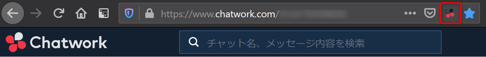
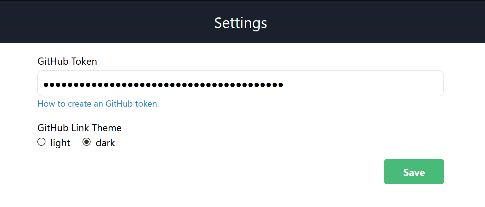
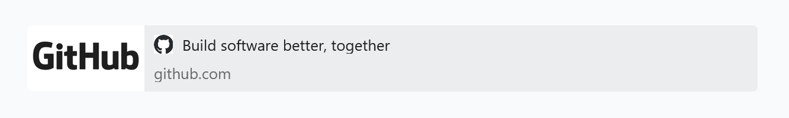
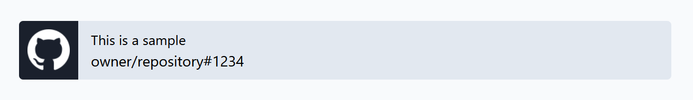

# Chatwork GitHub Extension

[English](README.md)

Chatwork を GitHub と連携するブラウザ拡張。
この拡張は www.chatwork.com で動作します。

## インストール

- [Chrome](https://chrome.google.com/webstore/detail/chatwork-github-extension/fmldllboekjkfejdlpmdbdkdkoifobjb?hl=ja)
- [Firefox](https://addons.mozilla.org/ja/firefox/addon/chatwork-github-extension/)

## 設定

拡張機能をインストールした後、GitHub パーソナルアクセストークンを設定する必要があります。
[こちら](https://docs.github.com/ja/github/authenticating-to-github/creating-a-personal-access-token) を参考にアクセストークンを作成してください。
スコープは repo を選択してください。

https://www.chatwork.com を開いてこの拡張機能のアイコンをクリックし、[Settings] をクリックするとオプションページが開きます。



作成したアクセストークンを入力して [Save] をクリックしてください。



保存できたら https://www.chatwork.com をリロードしてください。

## 機能

### より便利なリンクプレビュー

GitHub イシューとプルリクエストのリンクプレビューにタイトルと owner/repository#number が表示されるようになります。
Chatwork の設定でリンクプレビューが有効になっている必要があります。
リンクプレビューはデフォルトで有効になっています。

#### before




#### after




## ビルド

ビルドスクリプトは linux または unix で動作し、Node.js 14.x 以上が必要。

```sh
$ npm install
$ npm run build
```
