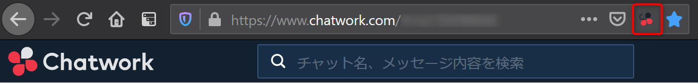
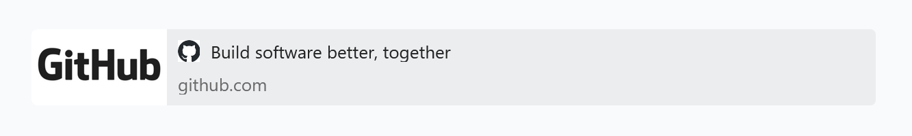

# Chatwork GitHub Extension

[日本語](README.ja.md)

This is a browser extension to integrate Chatwork with GitHub.
This extension works on www.chatwork.com.

## Usage

After install this extension, you must set GitHub personal access token.
Follow the instructions [here](https://docs.github.com/en/github/authenticating-to-github/creating-a-personal-access-token) to create an access token.

Open https://www.chatwork.com , click the icon of this extension and click [Settings] to open the options page.



Enter your access token and click [Save].


Please reload https://www.chatwork.com .

## Features

### More useful link preview

Show title and owner/repository#number on link previews of GitHub issues and pull requests.
This requires link preview enabled on Chatwork.
Link preview is enabled by default.

#### before




#### after


## Build

Build scripts works on linux or unix, and requires Node.js >= 14.x.

```sh
$ npm install
$ npm run build
```
